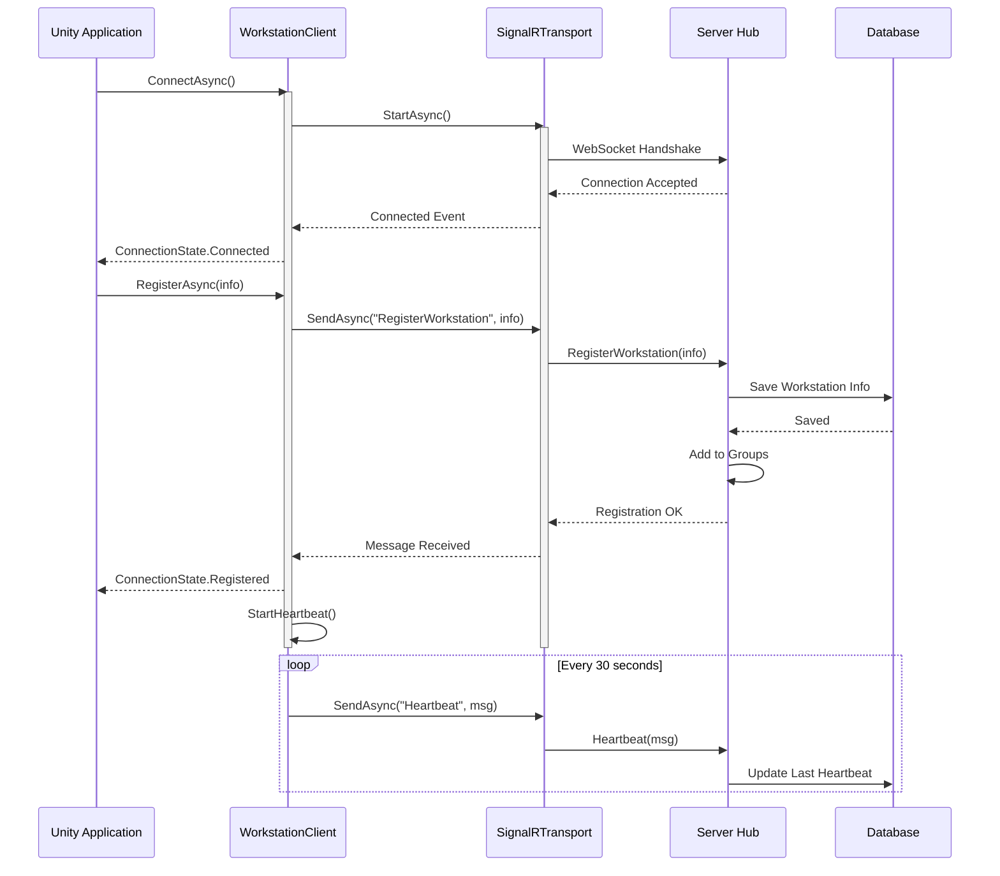
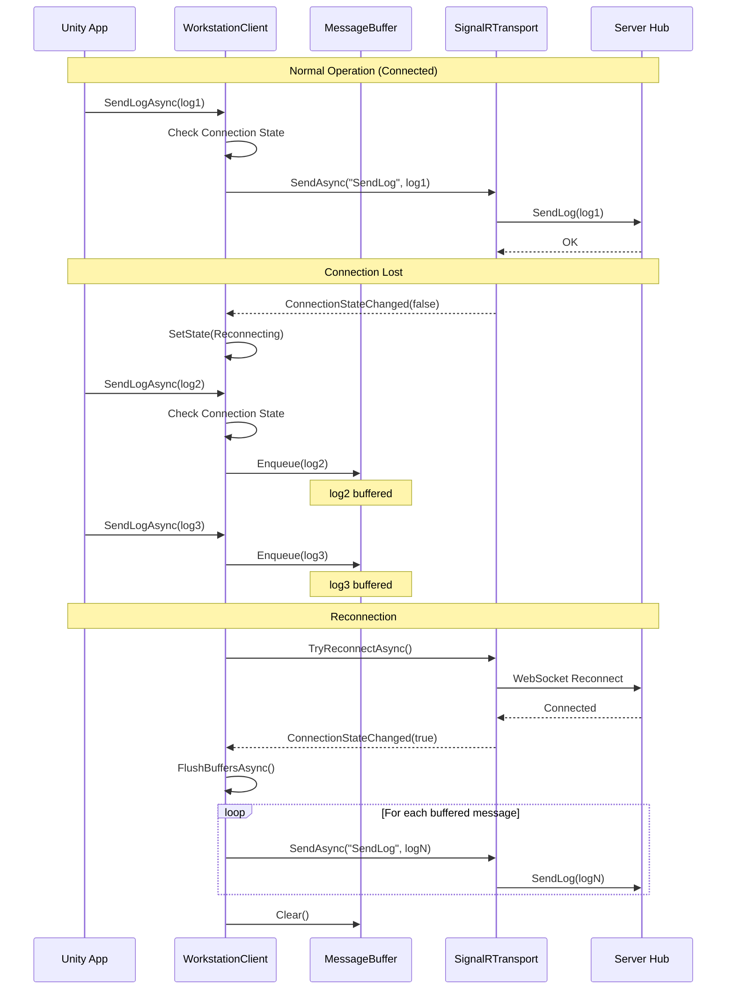
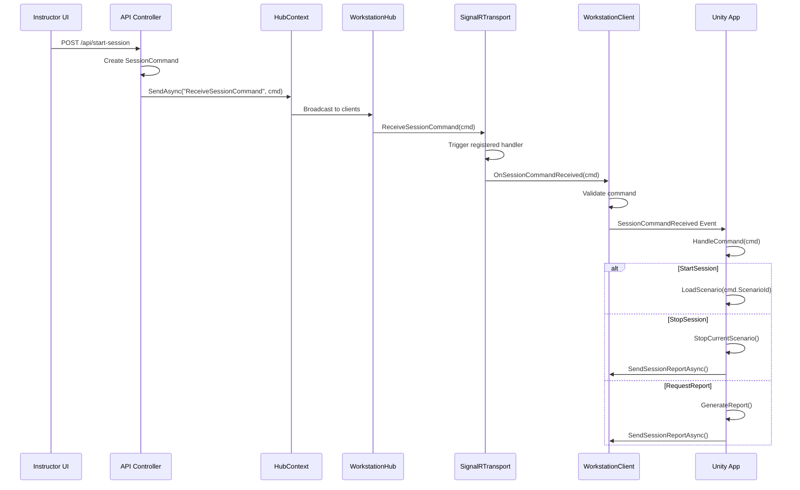
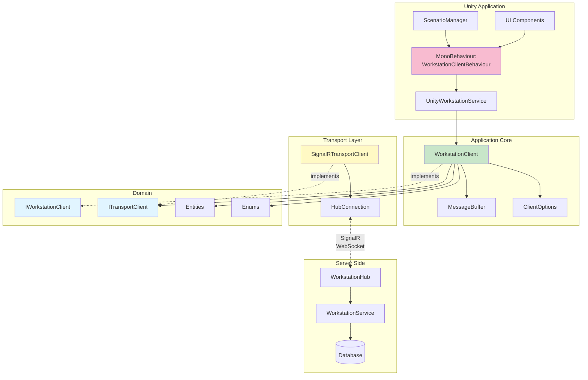
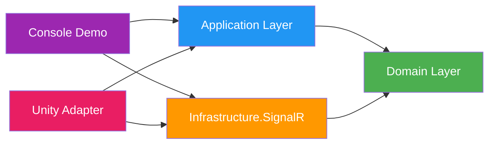
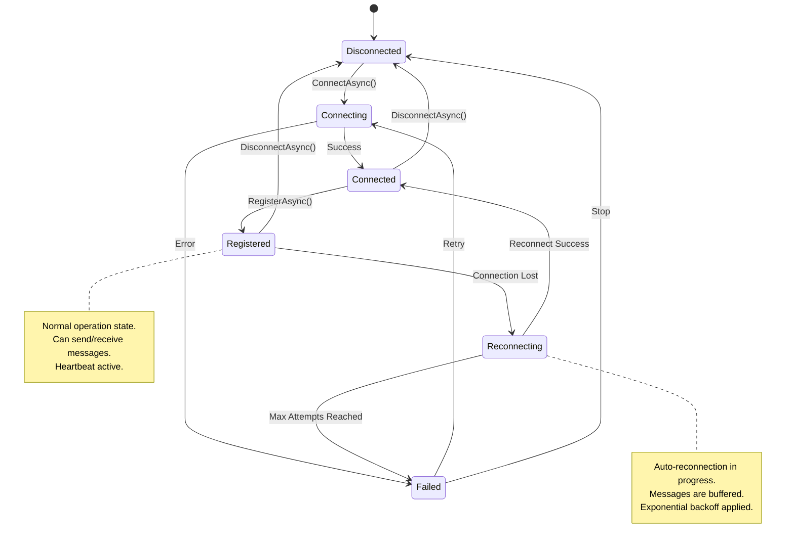
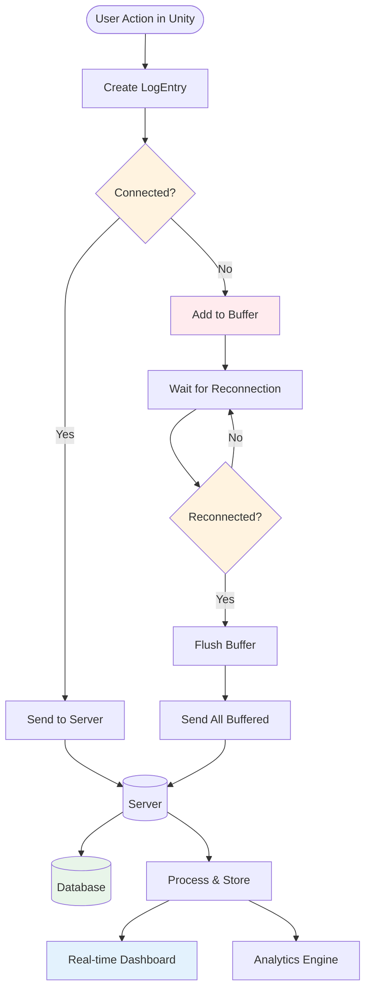

# Архитектурная документация

Детальное описание архитектуры модуля связи рабочих мест.

---

## 📐 Clean Architecture Layers

```
┌────────────────────────────────────────────────────────────────┐
│                     PRESENTATION LAYER                          │
│  ┌──────────────────────┐       ┌──────────────────────┐       │
│  │ Unity Adapter        │       │ Console Demo         │       │
│  │                      │       │                      │       │
│  │ - MonoBehaviour      │       │ - Test Application   │       │
│  │ - Unity Services     │       │ - Mock Scenarios     │       │
│  └──────────────────────┘       └──────────────────────┘       │
└────────────────────────────────────────────────────────────────┘
                           ▲
                           │ Depends on
                           │
┌────────────────────────────────────────────────────────────────┐
│                     APPLICATION LAYER                           │
│  ┌──────────────────────────────────────────────────────────┐  │
│  │ WorkstationClient (Orchestration)                        │  │
│  │                                                          │  │
│  │ - Connection Management     - Auto Reconnection         │  │
│  │ - Registration              - Heartbeat Management      │  │
│  │ - Message Buffering         - Event Translation         │  │
│  │ - Retry Logic               - State Management          │  │
│  └──────────────────────────────────────────────────────────┘  │
│  ┌──────────────────────────────────────────────────────────┐  │
│  │ MessageBuffer<T>                                         │  │
│  │ - Priority Queue            - Overflow Handling          │  │
│  └──────────────────────────────────────────────────────────┘  │
└────────────────────────────────────────────────────────────────┘
                           ▲
                           │ Depends on
                           │
┌────────────────────────────────────────────────────────────────┐
│                    INFRASTRUCTURE LAYER                         │
│  ┌──────────────────────────────────────────────────────────┐  │
│  │ SignalRTransportClient (ITransportClient)                │  │
│  │                                                          │  │
│  │ - HubConnection                - Custom Retry Policy    │  │
│  │ - WebSocket Transport          - Connection Events      │  │
│  │ - Auto Reconnection            - Message Routing        │  │
│  └──────────────────────────────────────────────────────────┘  │
└────────────────────────────────────────────────────────────────┘
                           ▲
                           │ Depends on
                           │
┌────────────────────────────────────────────────────────────────┐
│                        DOMAIN LAYER                             │
│  ┌──────────────────────────────────────────────────────────┐  │
│  │ Interfaces                                               │  │
│  │ - IWorkstationClient       - ITransportClient            │  │
│  └──────────────────────────────────────────────────────────┘  │
│  ┌──────────────────────────────────────────────────────────┐  │
│  │ Entities (Domain Models)                                 │  │
│  │ - WorkstationInfo          - SessionCommand              │  │
│  │ - LogEntry                 - SessionReport               │  │
│  │ - HeartbeatMessage                                       │  │
│  └──────────────────────────────────────────────────────────┘  │
│  ┌──────────────────────────────────────────────────────────┐  │
│  │ Enums                                                    │  │
│  │ - WorkstationType          - SubsystemType               │  │
│  │ - SessionCommandType       - ConnectionState             │  │
│  │ - SessionStatus            - LogLevel                    │  │
│  └──────────────────────────────────────────────────────────┘  │
└────────────────────────────────────────────────────────────────┘
```

---

## 🔄 Sequence Diagram: Подключение и регистрация



---

## 📤 Sequence Diagram: Отправка логов с буферизацией



---

## 📥 Sequence Diagram: Получение команды от инструктора



---

## 🧩 Component Diagram



---

## 🔐 Dependency Graph



**Ключевые принципы:**
- Domain layer не зависит ни от чего
- Application зависит только от Domain
- Infrastructure зависит только от Domain
- Presentation слой зависит от Application и Infrastructure

---

## 🔄 State Machine: Connection States



---

## 🗂 Data Flow Diagram



---

## 🎯 Design Patterns Used

### 1. **Repository Pattern**
- `IWorkstationClient` абстрагирует работу с коммуникацией
- Легко заменить реализацию (Mock для тестов)

### 2. **Adapter Pattern**
- `SignalRTransportClient` адаптирует SignalR к `ITransportClient`
- `UnityWorkstationService` адаптирует клиент для Unity

### 3. **Strategy Pattern**
- `ITransportClient` позволяет заменять транспорт (SignalR → WebSocket → HTTP)

### 4. **Observer Pattern**
- События: `ConnectionStateChanged`, `SessionCommandReceived`, `ErrorOccurred`

### 5. **Singleton Pattern** (в Unity)
- `WorkstationClientBehaviour` обычно единственный в сцене

### 6. **Decorator Pattern**
- Буферизация добавляет функциональность поверх транспорта

### 7. **Dependency Injection**
- Все зависимости передаются через конструкторы

---

## 📊 Performance Considerations

### Memory Management

```
MessageBuffer:
├── Default Size: 1000 messages
├── Memory per LogEntry: ~1-2 KB
├── Max Buffer Memory: ~1-2 MB
└── Overflow Strategy: Remove oldest
```

### Network Optimization

```
Heartbeat:
├── Interval: 30 seconds
├── Payload Size: ~200 bytes
├── Bandwidth: ~6.6 bytes/sec
└── Annual Traffic: ~200 MB/year per workstation
```

### Reconnection Strategy

```
Exponential Backoff:
├── Attempt 1: 2 seconds
├── Attempt 2: 4 seconds
├── Attempt 3: 8 seconds
├── Attempt 4: 16 seconds
├── Attempt 5: 32 seconds
└── Max Delay: 60 seconds
```

---

## 🔧 Extension Points

### Adding New Transport

```csharp
public class WebSocketTransportClient : ITransportClient
{
    // Implement WebSocket-specific logic
}

// Usage
var transport = new WebSocketTransportClient(options, logger);
var client = new WorkstationClient(transport, clientOptions, logger);
```

### Adding New Message Type

```csharp
// 1. Add to Domain/Entities
public record TelemetryMessage
{
    public string WorkstationId { get; init; }
    public Dictionary<string, double> Metrics { get; init; }
}

// 2. Add method to IWorkstationClient
Task SendTelemetryAsync(TelemetryMessage telemetry);

// 3. Implement in WorkstationClient
public async Task SendTelemetryAsync(TelemetryMessage telemetry)
{
    await _transportClient.SendAsync("SendTelemetry", telemetry);
}

// 4. Handle in Server Hub
[HubMethodName("SendTelemetry")]
public async Task SendTelemetry(TelemetryMessage telemetry)
{
    await _telemetryService.SaveAsync(telemetry);
}
```

### Adding Custom Event Handler

```csharp
// В Unity
_workstationClient.Service.Client.SessionCommandReceived += (s, e) =>
{
    if (e.Command.CommandType == SessionCommandType.CustomCommand)
    {
        HandleCustomCommand(e.Command);
    }
};
```

---

## 🧪 Testing Strategy

### Unit Tests

```csharp
[Test]
public async Task WorkstationClient_BuffersMessages_WhenDisconnected()
{
    // Arrange
    var mockTransport = new Mock<ITransportClient>();
    mockTransport.Setup(t => t.IsConnected).Returns(false);

    var client = new WorkstationClient(mockTransport.Object, options, logger);

    // Act
    await client.SendLogAsync(new LogEntry { Message = "test" });

    // Assert
    // Проверить, что сообщение буферизовано
}
```

### Integration Tests

```csharp
[Test]
public async Task EndToEnd_SendAndReceiveMessage()
{
    // Запустить тестовый сервер
    var server = CreateTestServer();

    // Создать реальный клиент
    var client = CreateRealClient(server.Url);

    // Отправить сообщение
    await client.SendLogAsync(log);

    // Проверить, что сервер получил
    Assert.That(server.ReceivedLogs, Contains.Item(log));
}
```

---

## 📈 Scalability

### Horizontal Scaling (Server Side)

```
┌──────────────┐     ┌──────────────┐
│ Workstation  │────▶│ Load         │
│ Client       │     │ Balancer     │
└──────────────┘     └──────┬───────┘
                            │
                ┌───────────┼───────────┐
                │           │           │
                ▼           ▼           ▼
         ┌──────────┐ ┌──────────┐ ┌──────────┐
         │ Hub      │ │ Hub      │ │ Hub      │
         │ Server 1 │ │ Server 2 │ │ Server 3 │
         └────┬─────┘ └────┬─────┘ └────┬─────┘
              │            │            │
              └────────────┼────────────┘
                           │
                           ▼
                    ┌─────────────┐
                    │ Redis       │
                    │ Backplane   │
                    └─────────────┘
```

**Setup:**
```csharp
builder.Services.AddSignalR()
    .AddStackExchangeRedis(config =>
    {
        config.Configuration.EndPoints.Add("redis-server:6379");
    });
```

---

## 🎓 Lessons Learned & Best Practices

### ✅ DO

- ✅ Use async/await everywhere for I/O operations
- ✅ Implement exponential backoff for reconnection
- ✅ Buffer messages during disconnection
- ✅ Use cancellation tokens
- ✅ Log all important events
- ✅ Handle all exceptions gracefully
- ✅ Validate input data
- ✅ Use strongly-typed hub methods

### ❌ DON'T

- ❌ Use `.Result` or `.Wait()` - causes deadlocks
- ❌ Ignore connection state changes
- ❌ Send large payloads (>1MB) through SignalR
- ❌ Block the UI thread
- ❌ Forget to dispose resources
- ❌ Hard-code configuration values
- ❌ Skip error handling

---

## 📚 References

- [ASP.NET Core SignalR Documentation](https://docs.microsoft.com/en-us/aspnet/core/signalr)
- [Clean Architecture by Robert C. Martin](https://blog.cleancoder.com/uncle-bob/2012/08/13/the-clean-architecture.html)
- [Unity Scripting API](https://docs.unity3d.com/ScriptReference/)

---

**Version:** 1.0
**Last Updated:** 2024-01-15
